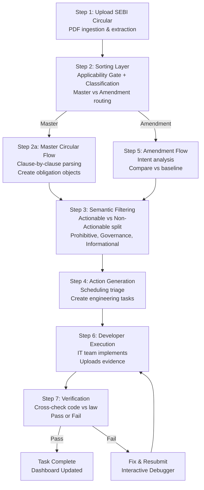

# RegMind.ai

**Agentic Compliance: From Regulatory Text to Operational Action**

RegMind.ai is an autonomous, multi-agent compliance automation platform that bridges the gap between regulatory text and operational code. We transform how financial institutions understand, implement, and continuously verify compliance with SEBI and RBI regulations.

---

## The Problem

Financial institutions face two critical compliance challenges:

1. **Regulatory Translation Gap**: SEBI circulars are written in legal language, but implementation is executed by engineering teams. This creates manual overhead, inconsistent understanding, and higher risk of compliance errors.

2. **Continuous Compliance Burden**: Organizations must continuously track obligations, maintain audit evidence, and identify compliance gaps. Today, this is largely manual—especially challenging for smaller firms with limited compliance resources.

---

## The Solution

RegMind.ai deploys a **closed-loop compliance system** that functions as a continuous state machine:

- Ingests regulatory documents (master circulars & amendments)
- Classifies and extracts obligations automatically
- Translates legal text into precise developer specifications
- Generates actionable engineering tasks with evidence checklists
- Verifies code compliance in real-time
- Maintains a secure audit trail

Instead of manual compliance sign-offs, our **Verification Agent** acts as an automated auditor, cross-checking engineering work against regulatory mandates instantly.

---

## Tech Stack

**Frontend**:
- React with responsive UI for compliance dashboards

**Backend**:
- FastAPI (Python) for high-performance API endpoints

**AI & Agents Framework**:
- **Orchestration**: LangChain for multi-agent coordination
- **Models**: Llama 3 / Mistral (open-source, privacy-first)
- **Runtime**: Ollama / vLLM for private, local execution
- **Infrastructure**: Private AWS GPU servers (fully isolated corporate cloud)

**Data & Search**:
- MongoDB for obligation and task storage
- Pinecone for vector-based semantic search

**Document Processing**:
- PyMuPDF for PDF parsing & text extraction
- Tesseract OCR for scanned document processing

---

## Security & Privacy

**Zero-Retention Processing**
- Regulatory documents, source code, configs, and logs are analyzed only during compliance checks
- Never permanently stored or used to train AI models

**Automatic Data Masking**
- Passwords, API keys, customer details, and internal IPs masked before AI processing
- Only compliance-related content analyzed

**Secure Audit Trail**
- Every compliance activity logged with timestamps
- Complete traceability for regulatory audits

---

## Business Model (Revenue Streams)

1. **B2B SaaS Subscription**: Monthly/annual recurring fees (scales with users, firm size, document volume)
2. **On-Premise / Private Cloud Deployment**: One-time implementation fee for bank-hosted installations
3. **Usage-Based Pricing**: Pay per regulatory document processed, AI request, or compliance task
4. **Enterprise Support & Maintenance**: 24/7 support, security patches, regulatory updates
5. **Custom Integrations**: Paid integration with Jira, ServiceNow, ERP systems

---

## Key Differentiators

- **Agentic Autonomy**: No manual compliance sign-offs—agents verify work automatically
- **State Machine Intelligence**: Understands live task status and routes amendments intelligently
- **Privacy-First**: All processing happens in customer's private cloud; zero data retention
- **Domain-Specialized**: LLM trained specifically on SEBI/RBI regulatory patterns
- **Real-Time Audit Trail**: Immutable record for regulatory demonstrations
- **Developer-Friendly**: Converts legal text to clear technical specifications with evidence checklists

---

## Team

**Team Square** — SEBI Securities Market TechSprint 2026

- **Anshu Roy** (Team Leader) — Engineering Physics, NIT Hamirpur | Full-Stack SDE
- **Aayush Dubey** — Co-Founder | Domain Expertise

---

## Current Status

**Idea Submission Round** — Conceptual architecture and business model validated.

**Roadmap**:
- [ ] Phase 1: Proof-of-concept with real SEBI circulars (Q3 2026)
- [ ] Phase 2: Beta deployment with pilot financial institution (Q4 2026)
- [ ] Phase 3: Enterprise SaaS launch (Q1 2027)
- [ ] Phase 4: RBI regulation support & multi-regulator expansion (2027)

---

## How It Works (End-to-End)

### Flow Diagram



### Step-by-Step Breakdown

RegMind.ai processes regulatory documents through a **7-step closed-loop pipeline**:

1. **Step 1: Upload & Ingestion** — SEBI circular uploaded as PDF; text extracted automatically.
2. **Step 2: Sorting Layer** — Applicability Gate determines if document applies to your firm. Classification Agent routes to Master Circular or Amendment flow.
3. **Step 3: Semantic Filtering** — Obligations split into actionable (engineering tasks) or non-actionable (reference library: prohibitive, governance, informational).
4. **Step 4: Action Generation** — Scheduling triage assigns urgency (Urgent/Recurring/Conditional). LLM converts legal language into developer-friendly task specs with measurable evidence checklists.
5. **Step 5: Amendment Flow** — When amendments arrive, the system evaluates the live status of the original task and intelligently routes the update (Open task → overwrite; Ongoing → alert developer; Completed → spawn delta task).
6. **Step 6: Developer Execution** — IT team builds and uploads technical evidence (code, config files, logs, API payloads).
7. **Step 7: Automated Verification** — Verification Agent cross-checks evidence against the regulatory blueprint. If correct, task auto-closes and compliance dashboard updates in real-time. If incorrect, Interactive Chatbot Debugger tells the engineer exactly what's missing.

The system cycles continuously: new regulations trigger new tasks, amendments dynamically modify existing ones, and every change is locked into an immutable audit trail.

---

## Repository Structure (Planned)

Once development begins:

```
regmind-ai/
├── frontend/              # React compliance dashboard
├── backend/               # FastAPI compliance engine
├── agents/                # LangChain agent orchestration
│   ├── sorting_layer/     # Applicability & classification agents
│   ├── action_generation/ # Scheduling & task creation
│   └── verification_layer/# Evidence validation & audit
├── models/                # Domain-trained LLMs (Llama/Mistral)
├── database/              # MongoDB schemas & Pinecone vector configs
├── docs/                  # Architecture & API documentation
└── README.md
```

---

## Contact & Contributions

**Team Lead**: Anshu Roy  
**Email**: 24bph025@nith.ac.in  
**Phone**: +91 77383 85936  

**Collaborator**: Aayush Dubey  
**Email**: dubeyaayushop@gmail.com

For inquiries, partnership opportunities, or to discuss regulatory use cases, reach out to the team above.

---

## License

This project is submitted to the SEBI Securities Market TechSprint 2026 competition. Licensing details to be finalized upon advancement.

---

## Acknowledgments

- SEBI TechSprint 2026 for the opportunity to innovate in regulatory technology
- NIT Hamirpur Engineering Physics Department for foundational knowledge
- Open-source community (LangChain, Ollama, Llama, Mistral, FastAPI)

---

**RegMind.ai: Making Compliance Code, Not Paperwork.**
